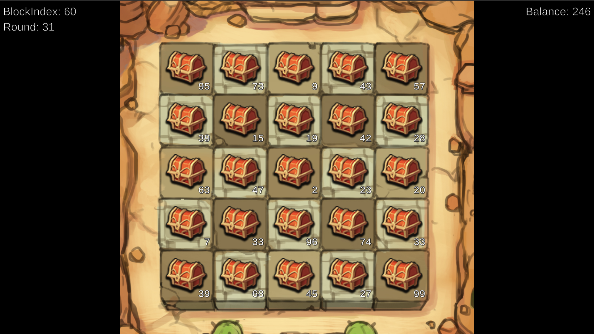

Minority Game
=============

This is a small blockchain game based on [Libplanet].

Each round consists of two blocks, the first one is for announcing
treasure chests and amounts in them to players, and the latter one
is for betting.  In the end of a round, bet players got win money,
which is divided by the number of all players bet to the same
treasure chest.  The point is, bigger chests will be shared by
more bettors, hence you need to do math whether to choose
a more competitive but more potential chest, or a less competitive
but less potential chest.

[Libplanet]: https://libplanet.io/

Build
-----

This is an ordinary Unity game project.  Open this directory in Unity Editor.
Unity 2019.1.0f2 or higher is required.

Todo
----

- [ ] GUI options to add other peers.
  (Currently you could specify through CLI options `--peer`.)
- [ ] GUI settings to turn off mining (corresponds to `--no-miner`).
